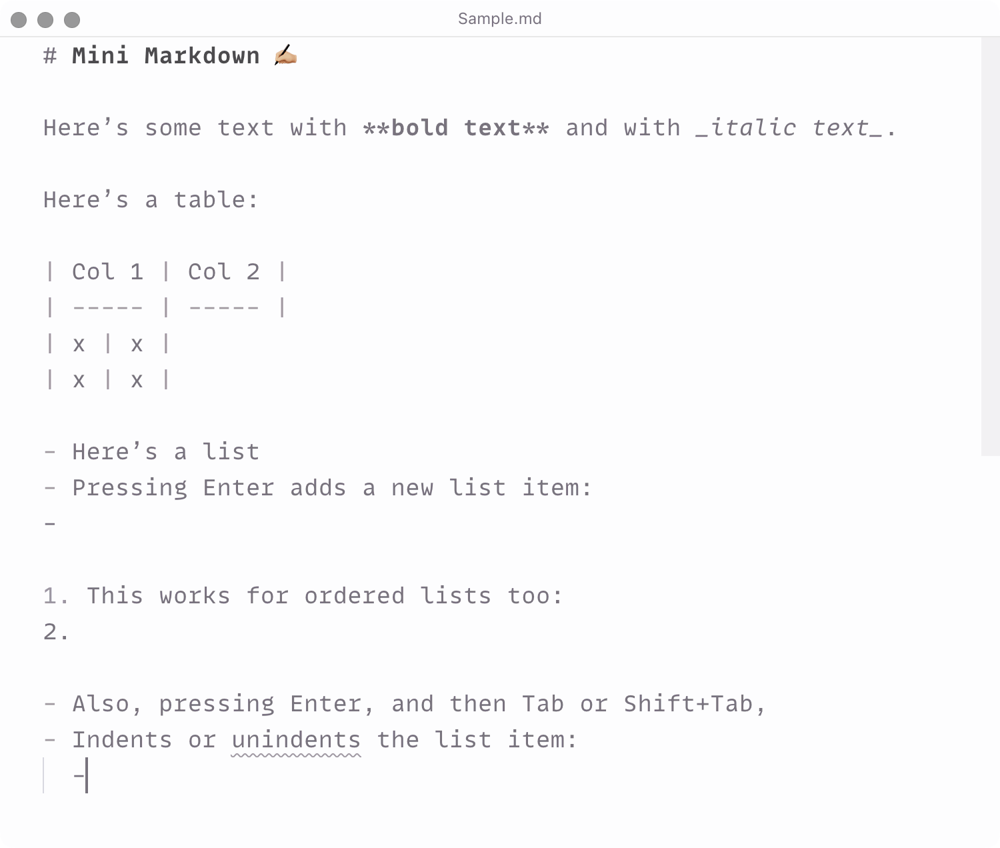

# Mini Markdown ✍🏼

A minimalist kit for comfortable Markdown writing: commands, hotkeys, autocomplete…

**[Install from Visual Studio Marketplace](https://marketplace.visualstudio.com/items?itemName=sapegin.mini-markdown)**

## Features

- Very minimal and fast.
- Commands to add **bold**, _italic_, and tables.
- Hotkeys to add **bold**, and _italic_.
- Autocomplete of list items.
- Code style matches Prettier formatting.
- Doesn’t pollute the editor with too many commands and hotkeys.

## Commands

You can either run this commands from the Command Palette (<kbd>Cmd</kbd>+<kbd>Shift</kbd>+<kbd>P</kbd> on a Mac, or <kbd>Ctrl</kbd>+<kbd>Shift</kbd>+<kbd>P</kbd> on Windows), or use hotkeys.

| Description | Name | Default Mac | Default Windows |
| --- | --- | --- | --- |
| Toggle emphasis (italic) | `miniMarkdown.toggleEmphasis` | <kbd>Cmd</kbd>+<kbd>B</kbd> | <kbd>Ctrl</kbd>+<kbd>B</kbd> |
| Toggle strong emphasis (bold) | `miniMarkdown.toggleStrongEmphasis` | <kbd>Cmd</kbd>+<kbd>I</kbd> | <kbd>Ctrl</kbd>+<kbd>I</kbd> |
| Insert a table | `miniMarkdown.insertTable` |  |  |

> [!TIP]  
> To insert a link in Markdown, copy the URL to the clipboard, select the text you want to link, and paste.

## Settings

You can [redefine the keybindings](https://code.visualstudio.com/docs/getstarted/keybindings) for the commands above.

## Changelog

The changelog can be found on the [Changelog.md](./Changelog.md) file.

## How is it different from other extensions?

Most Markdown extensions are bloated with commands and hotkeys I’d never need. In Mini Markdown I added only commands that I either use very often (like bold or italic), or can never remember the correct syntax (like tables). Other tools (like list autocomplete) make the writing comfortable.

## You may also like

Check out my other Visual Studio Code extensions:

- [Emoji Console Log](https://marketplace.visualstudio.com/items?itemName=sapegin.emoji-console-log): insert `console.log()` statements with a random emoji
- [New File Now](https://marketplace.visualstudio.com/items?itemName=sapegin.new-file-now): create new files from the command palette
- [Notebox](https://marketplace.visualstudio.com/items?itemName=sapegin.notebox): take quick notes in the bottom panel
- [Todo Tomorrow](https://marketplace.visualstudio.com/items?itemName=sapegin.todo-tomorrow): highlight `TODO`, `HACK`, `FIXME`, etc. comments
- [Squirrelsong Light Theme](https://marketplace.visualstudio.com/items?itemName=sapegin.Theme-SquirrelsongLight): low contrast non-distracting light theme for web developers
- [Squirrelsong Dark Theme](https://marketplace.visualstudio.com/items?itemName=sapegin.Theme-SquirrelsongDark): low contrast non-distracting dark theme for web developers

## Sponsoring

This software has been developed with lots of coffee, buy me one more cup to keep it going.

## Contributing

Bug fixes are welcome, but not new features. Please take a moment to review the [contributing guidelines](Contributing.md).

## Authors and license

[Artem Sapegin](https://sapegin.me), and [contributors](https://github.com/sapegin/vscode-mini-markdown/graphs/contributors).

MIT License, see the included [License.md](License.md) file.
